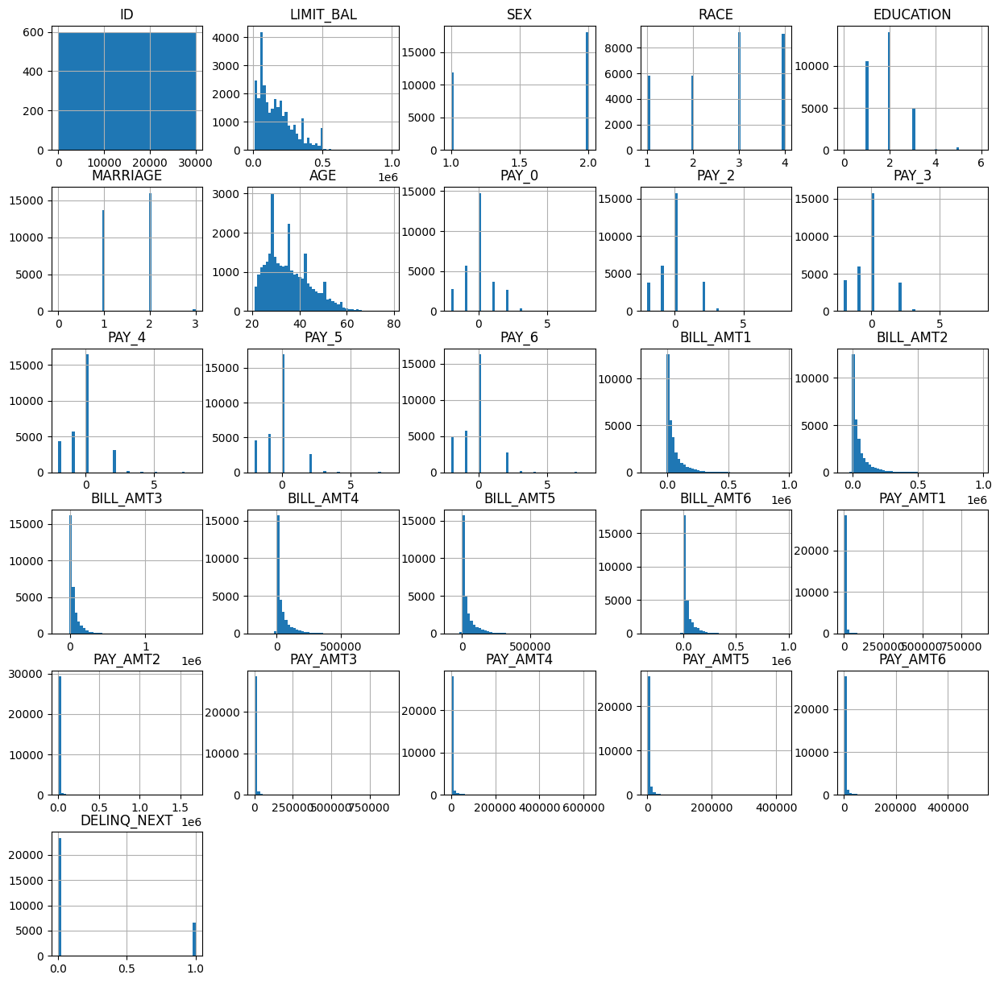

# Credit Line Increase Model Card

### Basic Information

* **Person or organization developing model**: John Doe, `jdoe@gwu.edu`
* **Model date**: October 6, 2022
* **Model version**: 1.0
* **License**: MIT
* **Model implementation code**: [DNSC_6301_Project.ipynb](DNSC_6301_Project.ipynb)

### Intended Use
* **Primary intended uses**: This model is an *example* probability of default classifier, with an *example* use case for determining eligibility for a credit line increase.
* **Primary intended users**: Students in GWU DNSC 6301 bootcamp.
* **Out-of-scope use cases**: Any use beyond an educational example is out-of-scope.

### Training Data

* Data dictionary: 

| Name | Modeling Role | Measurement Level| Description|
| ---- | ------------- | ---------------- | ---------- |
|**ID**| ID | int | unique row indentifier |
| **LIMIT_BAL** | input | float | amount of previously awarded credit |
| **SEX** | demographic information | int | 1 = male; 2 = female
| **RACE** | demographic information | int | 1 = hispanic; 2 = black; 3 = white; 4 = asian |
| **EDUCATION** | demographic information | int | 1 = graduate school; 2 = university; 3 = high school; 4 = others |
| **MARRIAGE** | demographic information | int | 1 = married; 2 = single; 3 = others |
| **AGE** | demographic information | int | age in years |
| **PAY_0, PAY_2 - PAY_6** | inputs | int | history of past payment; PAY_0 = the repayment status in September, 2005; PAY_2 = the repayment status in August, 2005; ...; PAY_6 = the repayment status in April, 2005. The measurement scale for the repayment status is: -1 = pay duly; 1 = payment delay for one month; 2 = payment delay for two months; ...; 8 = payment delay for eight months; 9 = payment delay for nine months and above |
| **BILL_AMT1 - BILL_AMT6** | inputs | float | amount of bill statement; BILL_AMNT1 = amount of bill statement in September, 2005; BILL_AMT2 = amount of bill statement in August, 2005; ...; BILL_AMT6 = amount of bill statement in April, 2005 |
| **PAY_AMT1 - PAY_AMT6** | inputs | float | amount of previous payment; PAY_AMT1 = amount paid in September, 2005; PAY_AMT2 = amount paid in August, 2005; ...; PAY_AMT6 = amount paid in April, 2005 |
| **DELINQ_NEXT**| target | int | whether a customer's next payment is delinquent (late), 1 = late; 0 = on-time |

* **Source of training data**: GWU Blackboard, email `jdoe@gwu.edu` for more information
* **How training data was divided into training and validation data**: 50% training, 25% validation, 25% test
* **Number of rows in training and validation data**:
  * Training rows: 15,000
  * Validation rows: 7,500

### Test Data
* **Source of test data**: GWU Blackboard, email `jdoe@gwu.edu` for more information
* **Number of rows in test data**: 7,500
* **State any differences in columns between training and test data**: Both training and test data came from the same file which are selected randomly.

### Model details
* **Columns used as inputs in the final model**: 'LIMIT_BAL',
       'PAY_0', 'PAY_2', 'PAY_3', 'PAY_4', 'PAY_5', 'PAY_6', 'BILL_AMT1',
       'BILL_AMT2', 'BILL_AMT3', 'BILL_AMT4', 'BILL_AMT5', 'BILL_AMT6',
       'PAY_AMT1', 'PAY_AMT2', 'PAY_AMT3', 'PAY_AMT4', 'PAY_AMT5', 'PAY_AMT6'
* **Column(s) used as target(s) in the final model**: 'DELINQ_NEXT'
* **Type of model**: Decision Tree 
* **Software used to implement the model**: Python, scikit-learn
* **Version of the modeling software**: Python version: 3.10.7, scikit-learn version: 1.1.2
* **Hyperparameters or other settings of your model**: 
```
DecisionTreeClassifier(ccp_alpha=0.0, class_weight=None, criterion='gini',
                       max_depth=6, max_features=None, max_leaf_nodes=None,
                       min_impurity_decrease=0.0, min_impurity_split=None,
                       min_samples_leaf=1, min_samples_split=2,
                       min_weight_fraction_leaf=0.0, presort='deprecated',
                       random_state=12345, splitter='best')
```
### Quantitative Analysis

#### **1.	Load and analyze data**

The create line increase was loaded in google colab. Basic data analysis was performed to identify the shape of data, get column names, find missing values, and generate descriptive statistics. The correlation matrix was calculated to find pairwise correlation of the columns in the data. All columns are visually represented as histograms. A correlation heatmap figure was generated to represent the correlation matrix. 


#### **2.	Train a decision tree model**

The data is partitioned into training, validation, and test sets (50%, 25%, 25% respectively) to accurately evaluate the model. Testing data which is used to evaluate the trained model to test how the model will perform on real data. 12 different models are trained using decision trees and calculated the ROC AUC for each model.
AUC ROC 
An ROC curve (Receiver Operating Characteristic curve) is a graph that shows performance of a classification model that is captured at all classification thresholds.
True Positive Rate (TPR): It is called recall and it is measured as:
TPR = TP/(TP+FN)
False Positive Rate (FPR): 
FPR = FP/(FP+TN)
ROC curve plots FPR on the x-axis and TPR on the y-axis at different classification thresholds. If threshold level is reduced, more items will be considered as positive. Thus, both False Positives and True Positives will increase.
The AUC curve is Area Under the ROC curve. The higher the AUC, the better the model can predict the target variable. The below graph shows that the maximum validation AUC is at depth 6.


The below plot is the plot of variable importance. It provides the variable importance that provides a list of the most significant variables in descending order. Pay_0 contribute most to the model and also have high predictive power in classifying the target variable.


Lastly, we calculate test AUC. 

|    Data Type     |   AUC    | 
| ---------------- | ---------| 
| Training Data    | 0.7837   |                           
| Validation Data  | 0.7496	  |                        
| Test Data        | 0.7438   |    

#### **3.	Test the model for discrimination**

It is very important to consider ethical measures such as fairness and security.

##### **Adverse Impact Ratio (AIR)**

Adverse impact is the negative effect an unfair and biased selection procedure has on a protected class. It occurs when a protected group is discrimination against during a selection process, like a hiring and promotion decision. 
The fourth-fifths rule state that if the selection class for a certain group is less than 80% of that of the group with the highest selection rate, there is adverse impact on that group.

##### **Racial bias**

The protected groups for racial bias testing are Hispanic, Black, and Asian. The reference group in this dataset is White. From the confusion matrices and AIR calculation, the Hispanic-to-White AIR is below the benchmark of 0.8. On the other side, the Black-to-white impact ratio is greater than 0.80. In this case, additional supporting evidence since the ratio is between 0.8 and 0.9(according to Office of Federal Contract Compliance Programs). The white-to-Asian AIR is 1.0 and thus favorable.

#### **Confusion Matrix by Hispanic Race**
| | actual: 1 | actual: 0 |
|-|-----------|-----------|
| **predicted: 1** | 447 | 387 |
| **predicted: 0** | 139 | 501 | 

#### **Confusion Matrix by Black Race**
| | actual: 1 | actual: 0 |
|-|-----------|-----------|
| **predicted: 1** | 449 | 348 |
| **predicted: 0** | 157 | 537 | 

#### **Confusion Matrix by White Race**
| | actual: 1 | actual: 0 |
|-|-----------|-----------|
| **predicted: 1** | 176 | 813 |
| **predicted: 0** | 72 | 1228 | 

#### **Confusion Matrix by Asian Race**
| | actual: 1 | actual: 0 |
|-|-----------|-----------|
| **predicted: 1** | 186 | 784 |
| **predicted: 0** | 59 | 1217 | 


We then compare the acceptance rates by race by computing the AIR between the two races. The results are listed in the tables below. Based on the AIR, the black and asian races are not in adverse risk since their acceptance rate is more than 80% that of white. However, the hispanic race is at adverse risk due to its AIR below 80%. We can see here that the White race has the highest acceptance rate and other races are lower than that. 

#### **Comparison of Acceptance Rates by Race**
| Race | Acceptance Rate | AIR (compared to White) |
|------|-----------------|-------------------------|
| White | 0.568 | 1.00 |
| Hispanic | 0.434 | 0.76 |
| Black | 0.465 | 0.82 |
| Asian | 0.568 | 1.00 |

##### **Gender bias**

The protected group for gender bias testing is female, and the reference group is male. The AIR value is favorable for women because it exceeds the best scenario by 0.06. This indicates that a higher number of females are awarded a loan as compared to males.

#### **Confusion Matrix by Male**
| | actual: 1 | actual: 0 |
|-|-----------|-----------|
| **predicted: 1** | 546 | 905 |
| **predicted: 0** | 179 | 1292 | 

#### **Confusion Matrix by Female**
| | actual: 1 | actual: 0 |
|-|-----------|-----------|
| **predicted: 1** | 712 | 1427 |
| **predicted: 0** | 248 | 2191 | 

#### **4.	Remediate discovered discrimination**

It is a common scenario that Black and Hispanic groups face difficulty in getting approval for home loans as compared to White and Asian people. In 2015, 27.4% of the Black applicants and 19.2% of Hispanic applicants were denied mortgages, compared with about 11% of White and Asian applicants which can be also observed in our initial model. The biased behavior of ML models has adverse effects on society. With our initial probability cutoff of 0.15, the Hispanic-to-White AIR fell below the minimum acceptable value of 0.80 and the Black-to-White AIR was just over 0.80 by 0.02.
Notice that the cutoff may influence the result. Changing the cutoff of 0.18 rather than 0.15, we tried to remediate biases by recalculating AIR and confusion matrices. Next, we again run the model search by training decision trees with validation-based early stopping. Instead of picking the best model defined by AUC, we worked on 12 different models and observed the trade-off between performance and fairness indicators. The model balanced between two factors was chosen. The following table shows that the AIR value of Hispanic-to-White and Black-to-White was impacted positively after applying 0.18 of the cutoff rate.

#### White proportion accepted :     0.735
#### Hispanic proportion accepted :   0.613
#### **Hispanic to White AIR : 0.83**

#### **-----------------------------------**

#### White proportion accepted :     0.735
#### Black proportion accepted :   0.626
#### **Black to White AIR : 0.85**

#### **-----------------------------------**

#### White proportion accepted :     0.735
#### Asian proportion accepted :   0.739
#### **Asian to White AIR : 1.00**


The below table indicates the final value of the metrics for all data: training, validation, and test data.

|  **Data Type**     |   **AUC**   | 
| ----------------   | ----------- | 
| Training Data      | 0.7837      |                           
| Validation Data    | 0.7496	     |                        
| Test Data          | 0.7438      |      

|  **Race**          |  **AIR (0.15 cutoff)** | **AIR (0.18 cutoff)**|
| -------------------| ---------------------  | -------------------- |
| White to Hispanic  | 0.76                   | 0.83                 |     
| White to Black     | 0.82  	                | 0.85                 |  
| White to Asian     | 1.00                   | 1.00                 |  

|  **Gender**        |  **AIR (0.15 cutoff)** | **AIR (0.18 cutoff)**|
| -------------------| ---------------------  | -------------------- |
| Male to Female     | 1.06                   | 1.02                 |     


#### ETHICAL CONSIDERATIONS

#### **1. Negative impacts of using the model:**

Math/Software Problems: There is always a high risk of attaining inconsistent result if results are based on recent payment trend while the long-term trends of are overlooked. One of the software problems in this model also the variable is carrying significant importance too.
Real world risks: Because of inconsistent result, it is likely that the customers’ credit limit may remain plateau, if not dipped, i.e., increase in credit limits of customer’s’ are almost unlikely. Since, the model is little biased, applying it to real world could have severe negative impact.

#### **2. Potential uncertainties relating to the impacts of using the model:**

Math/Software Problems: A classic example of software problem is that it is quite possible because of one or few low metrics among several high scoring metrics may cause an unjustified result, eventually causing low credit limit for customers.
Real world risks: If the output of model will be implemented by the users, then the customers will not be granted additional credit what they deserve. In bigger prospect it will not only hamper the individual but also will adversely impact the economy, a negative aftermath of bias model.

#### **3. Other unexpected results:**

There is a very high probability that real-world data will have missing values. We have seen that there is no missing value in our data. It is evident from the variable importance chart that PAY_0 variable has the most critical role in the model. Thus, the model is dependent on the most recent payment instead of the consistent payment history. Still, the above-unexpected results do not disqualify the model, however, it is important to be aware of them. 


#### **Sources:**

1.	Desilver, D., & Bialik, K. (2017, January 10). Blacks and Hispanics face extra challenges in getting home loans. Pew Research Center. https://www.pewresearch.org/fact-tank/2017/01/10/blacks-and-hispanics-face-extra-challenges-in-getting-home-loans/
2.	Hall, P. (n.d.). Increase Fairness in Your Machine Learning Project with Disparate Impact Analysis using Python and H2O. Jupyter. https://nbviewer.org/github/jphall663/interpretable_machine_learning_with_python/blob/master/dia.ipynb
3.	U.S. Department of Labor. (n.d.). Practical Significance in EEO Analysis Frequently Asked Questions. https://www.dol.gov/agencies/ofccp/faqs/practical-significance


We used Area Under the ROC Curve (AUC) to assess the performance of the model. The ROC curve is defined as the Receiver Operating Characteristic curve. It shows the performance of a classification model at all classification thresholds. The ROC curve plots two variables: 
* True Positive Rate 
* False Positive Rate

AUC gives us the area under the ROC curve which is the area from FP Rate = 0 to FP Rate = 1. A model with an AUC of 0.0 is 100% wrong while a model with an AUC of 1.0 is 100% correct. Real-world models are in between theses two values. 

We also use Adverse Impact Ratios (AIR) to see analyze the impact of the classification model. Adverse impact is the negative effect an unfair and biased selection procedure has on a protected class. It occurs when a protected group is discriminated against during a selection process, like approving loans for the bank. If the selection rate for a certain group is less than 80% of that of the group with the highest selection rate, there is an adverse impact on that group. 

Based on our final model, the computed AUCs and AIR are shown in the table below with varying depth of Decision Tree Classifier.

| Depth | Training AUC | Validation AUC | 5-Fold SD | Hispanic-to-White-AIR |
| ----- | ------------ | -------------- | --------- | --------------------- |
| 1 | 0.645748 |	0.643880|	0.009275|	0.894148|
| 2|	0.699912|	0.687752	|0.012626|	0.850871|
|3	|0.742968|	0.729490|	0.017375|	0.799546|
|4	|0.757178|	0.741696|	0.017079|	0.792435|
|5	|0.769331|	0.742480|	0.019886|	0.829336|
|6	|0.783722|	0.749610|	0.017665|	0.833205|
|7	|0.795777|	0.742115|	0.022466|	0.835886|
|8	|0.807291|	0.739990|	0.015567|	0.811300|
|9	|0.822913|	0.727224|	0.012042|	0.811561|
|10	|0.838052|	0.720562|	0.013855|	0.803621|
|11	|0.855168|	0.709864|	0.010405|	0.837806|
|12	|0.874251|	0.688074|	0.008073|	0.844889| 

The data in the table above is plotted below to see the variation of the metrics on different values of Decision Tree Classifier depths.


We also analyzed the correlation between pairs of columns in the raw data. The correlation heatmap is shown in the image below. 


We also computed the data histograms for each parameter so we can see the distribution of values for each parameter. We can see from the figure that most of the parameters are skewed to the lower value of the range. The skew could affect the accuracy of the measure of central tendency that we used. 



Our best model is the Decision Tree with depth of 7. This is the depth with the maximum Training AUC. At this point, the Validation AUC is 0.742115 and the Hispanic-to-White AIR is 0.835886. This means that using this model will not put the Hispanic group in adverse situation. The resulting tree is shown below.


Based on the results of the training data, we also analyzed the features as to its effect on the dependent varaible. The plot below shows a comparison of the importance of variables. The more important a variable is, the more it affects the result. We can see that the variable PAY_0 has the largest influence on the program. The first payment seems to be the major contributor. The least important variable is the PAY_5 variable. This means that the 6th payment has the least importance in the approval of loan.


We have seen in the graph above the effect of credit history on the approval of loan. But it is known in real-life situation that demographics also affects loan approval. At this part, we want to check if there is any bias on the approval among the demographic variables. We used the confusion matrix to evaluate the biases. The tables are shown below.

#### **Confusion Matrix by Hispanic Race**
| | actual: 1 | actual: 0 |
|-|-----------|-----------|
| **predicted: 1** | 447 | 387 |
| **predicted: 0** | 139 | 501 | 

#### **Confusion Matrix by Black Race**
| | actual: 1 | actual: 0 |
|-|-----------|-----------|
| **predicted: 1** | 449 | 348 |
| **predicted: 0** | 157 | 537 | 

#### **Confusion Matrix by White Race**
| | actual: 1 | actual: 0 |
|-|-----------|-----------|
| **predicted: 1** | 176 | 813 |
| **predicted: 0** | 72 | 1228 | 

#### **Confusion Matrix by Asian Race**
| | actual: 1 | actual: 0 |
|-|-----------|-----------|
| **predicted: 1** | 186 | 784 |
| **predicted: 0** | 59 | 1217 | 

We then compare the acceptance rates by race by computing the AIR between the two races. The results are listed in the tables below. Based on the AIR, the black and asian races are not in adverse risk since their acceptance rate is more than 80% that of white. However, the hispanic race is at adverse risk due to its AIR below 80%. We can see here that the White race has the highest acceptance rate and other races are lower than that. 

#### **Comparison of Acceptance Rates by Race**
| Race | Acceptance Rate | AIR (compared to White) |
|------|-----------------|-------------------------|
| White | 0.568 | 1.00 |
| Hispanic | 0.434 | 0.76 |
| Black | 0.465 | 0.82 |
| Asian | 0.568 | 1.00 |

Besides race, we also analyze the AIR between female and male sexes. The confusion matrix showing the acceptance rate is shown in the tables below.

#### **Confusion Matrix by Male**
| | actual: 1 | actual: 0 |
|-|-----------|-----------|
| **predicted: 1** | 546 | 905 |
| **predicted: 0** | 179 | 1292 | 

#### **Confusion Matrix by Female**
| | actual: 1 | actual: 0 |
|-|-----------|-----------|
| **predicted: 1** | 712 | 1427 |
| **predicted: 0** | 248 | 2191 | 

Looking at the data by sexes, we can see almost similar acceptance rate between the two sexes. Hence, we can see that there is little difference between the two sexes in terms of acceptance rate.

#### **Comparison of Acceptance Rates by Sex**
| Sex | Acceptance Rate | AIR (compared to Male) |
|------|-----------------|-------------------------|
| Male | 0.503 | 1.00 |
| Female | 0.533 | 1.06 |

From the analysis above, we have to adjust the model not to put the Hispanic race at risk. Right now, we have AIR of 0.76 which is less than 0.80. From here, we adjusted the cut-off to fix this issue. After several tries, we arrived at a cut-off of 0.18. We recomputed the confusion matrices and the acceptance rates. The results are shown below.

With the adjusted cut-off, we were able to increase the acceptance rates across all races and sexes. From the table below, we can see that the AIR of Hispanic race increased from 0.76 to 0.83. The AIR of Black race increased from 0.82 to 0.85. From the AIR between female and male, we can see here that the acceptance rates are close to each other. 

#### **Comparison of Revised Acceptance Rates by Race**
| Race | Revised Acceptance Rate | AIR (compared to White) |
|------|-------------------------|-------------------------|
| White | 0.735 | 1.00 |
| Hispanic | 0.613 | 0.83 |
| Black | 0.626 | 0.85 |
| Asian | 0.739 | 1.00 |

#### **Comparison of Revised Acceptance Rates by Sex**
| Sex | Revised Acceptance Rate | AIR (compared to Male) |
|-----|-------------------------|-------------------------|
| Male | 0.682 | 1.00 |
| Female | 0.696 | 1.02 |

With the updated cut-off, we recomputed the AUC for various tree depths. We calculated from 1 to 12 tree depth. The AUC are shown below. Here we can see that there is a gradual increase in the training AUC. This is due to overfitting of data. We must look at the validation AUC since it involves data points that are not included in the training. From the iteration plot below, we can see that the validation AUC drops as we increase the depth to more than 6. As the model is overfitted, it gets less accurate to other parts of the data. 


### Ethical Considerations

#### Potential Negative Impacts
*Math or Software Problems:* 
Using this model is based on running through a small dataset. Mathematically, this means that the data is not reliable since it is not representative of the population. It requires further testing to larger dataset so we can verify that it maintains a reasonable AUC and AIR levels. In addition to that, we have used scikit learn software as a model which is relatively stable. Scikit learn may not be fast enough if we train the model using a larger dataset. Hence, we can use other modelling software with larger data capacity and faster execution time. 

*Real-world risks:* 
Due to concerns on reliability of the model, we must be careful in using this in the actual world. Disapproving loans to credit worthy invdividuals due to a mistake on this model can be a matter of losing a home or business for that individual. This could pose real life effects that.

#### Potential Uncertainties
*Math or Software Problems:*
Due to the limited dataset used in our model, the prediction can have a high uncertainty. Since we are using third-party software to run the model, there might be bugs and issues in it that will affect the execution of the model. 

*Real-world risks:* 
Real-world risks are there in the use of this model. If banks will use this model as basis of their decision, this will affect the life of people. 
